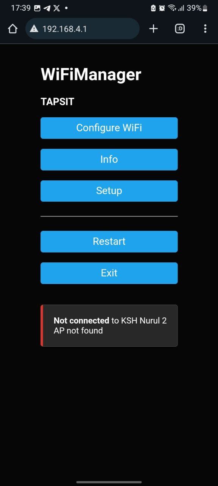

# TAPSIT FIRMWARE

Firmware diprogram dengan menggunakan software PLATFORM IO pada Visual Studio Code. Program menggunakan framework milik arduino dengan tujuan mempermudah penggunaan library pada sistem.

## LIBRARY

Library yang kami gunakan untuk memprogram firware dari system kami meliputi sebagai berikut.  

#### 1. <WiFi.h> dan <WiFiManager.h>

        Library `wifi`  digunakan untuk menghubungkan system hardware dengan koneksi internet dengan protokol wifi atan wlan (wireless lan). Untuk melakukan konfigurasi tersebut, digunakanlah  library `wifi manager`. Salah satu Kelebihan dari library wifi manager ada pada fitur penyimpanan konfigurasi wifi yang telah disetting. Library `wifi manager` juga kami setting secara `advance` untuk memberikan input parameter tambahan yang dicustom untuk memberikan suatu variable untuk device tersebut.  Pada library `wifi manager` yang disetting advance juga dapat menambahkan button untuk melakukan reset konfigurasi dari koneksi wifi dan juga dapat membuat suatu algoritma timeout ketika wifi tidak dapat tersambung.

#### 2. <PubSubClient.h>

        Library `PubSubClient` adalah library Arduino yang digunakan untuk mengimplementasikan komunikasi **Message Queue Telemetry Transport* (MQTT) pada microcontroller seperti ESP32 atau ESP8266. `MQTT` merupakan protokol komunikasi yang ringan dan banyak digunakan dalam aplikasi *Internet of Things* (IoT) untuk mengirim dan menerima data antara perangkat dan *server* (broker) melalui jaringan internet.

#### 3. <Preferences.h>

        Library `Preferences` di ESP32 memungkinkan penyimpanan data secara non-volatile, sehingga data tetap tersimpan meskipun perangkat dimatikan atau di-restart. Dengan menggunakan `Preferences`, kamu dapat menyimpan berbagai jenis data, seperti string, integer, dan boolean, dengan cara yang mudah dan efisien. Proses dimulai dengan menginisialisasi objek `Preferences` di dalam fungsi `setup()`, kemudian menyimpan data seperti nomor meja atau identitas hardware menggunakan metode `putString()`, `putInt()`, atau metode lainnya sesuai tipe data yang diinginkan. Untuk mengambil data yang telah disimpan, cukup gunakan metode `getString()` atau `getInt()` dengan kunci yang sama yang digunakan saat menyimpan. Selain itu, library ini juga menyediakan fungsi untuk menghapus data yang disimpan jika diperlukan. Semua data yang disimpan berada dalam flash memory ESP32, sehingga tetap dapat diakses setelah perangkat dimatikan. Dalam aplikasi kamu, library `Preferences` digunakan untuk menyimpan data nomor meja atau identitas hardware ESP32 yang didapat dari custom parameter WiFi Manager Advance, memastikan bahwa informasi ini selalu tersedia bahkan setelah perangkat di-restart. Dengan demikian, library `Preferences` sangat cocok digunakan untuk menyimpan informasi penting yang perlu diakses kembali setelah restart, seperti data konfigurasi atau identitas unik dalam aplikasi IoT.

#### 4. <SPI.h> dan <MFRC522.h>

      Library `<SPI.h>` dan `<MFRC522.h>` kami gunakan secara bersamaan untuk mengoperasikan RFID reader MFRC522 dengan mikrokontroler seperti Arduino atau ESP32. Library `<SPI.h>` menyediakan antarmuka untuk komunikasi SPI (Serial Peripheral Interface), yang merupakan protokol yang diperlukan untuk berkomunikasi dengan perangkat seperti MFRC522. Di sisi lain, library `<MFRC522.h>` menyediakan fungsi khusus untuk mengatur dan mengelola operasi RFID, termasuk membaca dan menulis data pada kartu RFID. Penggunaannya dimulai dengan menginisialisasi objek MFRC522 dan mengatur koneksi SPI di dalam fungsi `setup()`. Setelah itu, kami dapat menggunakan berbagai fungsi yang disediakan oleh library ini untuk mendeteksi kartu RFID, membaca informasi dari kartu, atau melakukan operasi lain yang berkaitan dengan RFID. Kombinasi kedua library ini memungkinkan kami untuk mengembangkan aplikasi berbasis RFID yang efektif, seperti sistem akses kontrol atau manajemen inventaris, dengan cara yang sederhana dan intuitif.

        
#### 5. "esp32-hal-timer.h"

        File header `esp32-hal-timer.h` dalam framework Arduino untuk ESP32 digunakan untuk mengelola timer dengan efisien. File ini menyediakan fungsi untuk menginisialisasi dan mengonfigurasi timer dalam mode one-shot dan periodic, serta memungkinkan pengaturan prescaler untuk menentukan kecepatan penghitungannya. Salah satu fitur utamanya adalah kemampuan untuk mengatur interrupt, yang memicu eksekusi kode secara otomatis saat timer mencapai nilai tertentu. Dalam pengaplikasiannya, kami menggunakan timer ini untuk memperbarui  baterai sistem setiap 30 menit. Dengan demikian, `esp32-hal-timer.h` menyederhanakan pengelolaan timer, memungkinkan pengembang untuk membuat aplikasi yang responsif dan terjadwal dengan baik dalam lingkungan IoT.

## ALGORTIMA PROGRAM

        Program ini adalah sistem komunikasi berbasis IoT yang memanfaatkan ESP32 untuk menghubungkan perangkat ke jaringan Wi-Fi dan broker MQTT guna mengirimkan data yang diperoleh dari pembacaan kartu RFID. Pada fungsi setup, inisialisasi dilakukan pada beberapa komponen yang digunakan, seperti koneksi Wi-Fi, modul MQTT, dan sensor RFID, yang masing-masing membutuhkan library tertentu. Wi-Fi dikonfigurasi dengan bantuan `WiFiManager` untuk memudahkan koneksi secara dinamis, tanpa perlu memasukkan kredensial Wi-Fi secara manual pada setiap penggunaan. Hal ini memungkinkan perangkat untuk membuka portal konfigurasi jika koneksi Wi-Fi gagal, sehingga pengguna dapat memasukkan kredensial baru.

        Pada fungsi setup ini, perangkat ESP32 memeriksa apakah sudah ada data `deviceID` yang tersimpan di memori non-volatile `Preferences`. Jika `deviceID` tidak ditemukan, maka perangkat akan menggunakan nilai default. `Preferences` digunakan untuk menyimpan informasi yang dapat diakses kembali ketika perangkat dinyalakan ulang, yang memastikan bahwa pengaturan yang pernah dilakukan oleh pengguna tetap bertahan. Selain itu, pada tahap setup ini, kanal PWM disiapkan untuk buzzer dengan frekuensi dan resolusi tertentu, dan modul RFID diinisialisasi melalui antarmuka SPI, yang memungkinkan pembacaan UID kartu RFID.

        Setelah koneksi Wi-Fi berhasil, perangkat ESP32 menghubungkan diri ke broker MQTT. Program menggunakan library `PubSubClient` untuk mengelola komunikasi dengan server MQTT. Pengaturan koneksi ke broker MQTT dilakukan dengan mendefinisikan server, port, username, dan password untuk mengautentikasi perangkat saat menghubungkan diri ke broker. Fungsi `reconnect()` digunakan untuk menangani skenario ketika koneksi ke broker terputus. Dalam fungsi ini, perangkat akan terus berusaha menghubungkan diri ke broker sampai koneksi berhasil, memastikan aliran data tetap lancar.

        Program ini juga menggunakan timer untuk memicu fungsi interrupt setiap 10 detik guna mengukur level baterai pada perangkat. Pada fungsi interrupt `onTimer()`, perangkat membaca level baterai dengan mengukur nilai analog dari pin tertentu dan mengonversinya menjadi persentase untuk memudahkan interpretasi. Nilai persentase ini kemudian disimpan dalam variabel `batt`, yang akan dikirim bersama data lainnya melalui MQTT. Penggunaan timer dengan fungsi interrupt memungkinkan pembacaan level baterai secara periodik tanpa mengganggu operasi utama dalam loop.

        Pada loop utama, program memverifikasi apakah perangkat masih terhubung dengan broker MQTT. Jika koneksi terputus, fungsi `reconnect()` dipanggil kembali untuk memperbarui koneksi. Program juga memiliki fungsi `checkButton()` yang memeriksa apakah tombol konfigurasi pada perangkat ditekan. Jika tombol ditekan dan ditahan selama 3 detik, konfigurasi Wi-Fi pada perangkat akan di-reset, sehingga perangkat dapat memulai ulang koneksi Wi-Fi dengan mengaktifkan kembali portal konfigurasi. Ini memungkinkan pengguna untuk mengonfigurasi ulang koneksi Wi-Fi sesuai kebutuhan.

        Ketika kartu RFID terdeteksi, perangkat membaca UID kartu dan menyusunnya dalam string `msg` bersama dengan data `deviceID` dan level baterai. Data ini diformat dan dikirim ke broker MQTT melalui topik "tapsit". Setelah pesan berhasil dikirim, LED dan buzzer memberikan indikasi kepada pengguna dengan menyalakan LED merah dan mengaktifkan bunyi buzzer. Fungsi ini diatur dengan menyesuaikan frekuensi PWM pada buzzer, memberikan notifikasi bahwa kartu telah berhasil terbaca dan data telah dikirim.

        Pada fungsi `saveParamCallback()`, program menyimpan nilai `deviceID` yang diperoleh dari input pengguna ke dalam `Preferences`. Fungsi ini dipanggil ketika pengguna menyimpan pengaturan di portal konfigurasi. Dengan menyimpan `deviceID` dalam `Preferences`, perangkat akan tetap memiliki informasi ini setelah dinyalakan ulang, memungkinkan akses berkelanjutan ke data yang tersimpan. Proses ini memastikan bahwa konfigurasi perangkat dapat dipertahankan tanpa perlu diatur ulang secara manual setiap kali perangkat dimatikan atau mengalami reset. Pada proram ini data yang disimpan di preferences merupakan identitas dari device yaitu nomor device dimana akan ditempatkan di suatu meja.

