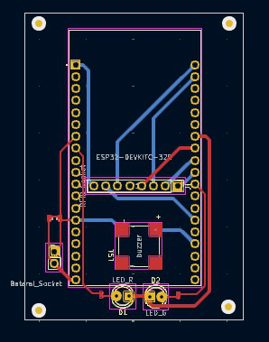

  <h1>WORKSHOP MIKROKONTROLLER - PROGRAM STUDI TEKNIK ELEKTRONIKA - POLITEKNIK ELEKTRONIKA NEGERI SURABAYA</h1>
  
DOSEN PENGAMPU : Akhmad Hendriawan ST, MT   NIP. 197501272002121003  Dibuat Oleh : Ahmad Zen Ashari  NRP : 2122600009

 <h2>Penjelasan Skematik</h2>

<h3> Daftar pin yang digunakan </h3>
<!-- Tabel dengan CSS di file Markdown -->

    <table>
        <thead>
            <tr>
                <th>No</th>
                <th>Pin GPIO Ke- </th>
                <th>Alasan</th>
                <th>Fungsi</th>
            </tr>
        </thead>
        <tbody>
            <tr>
                <td>1</td>
                <td>32</td>
                <td>Aman untuk I/O</td>
                <td>Input info daya baterai</td>
            </tr>
            <tr>
                <td>2</td>
                <td>15</td>
                <td>Aman untuk I/O</td>
                <td>Output ke buzzer</td>
            </tr>
            <tr>
                <td>3</td>
                <td>33</td>
                <td>Aman untuk I/O</td>
                <td>Output ke LED_G</td>
            </tr>
            <tr>
                <td>4</td>
                <td>17</td>
                <td>Aman untuk I/O</td>
                <td>Output ke LED_R</td>
            </tr>
         </tbody>
    </table>

Untuk file skematik, dapat diunduh <a href="https://drive.google.com/file/d/1diomlFyTaUs_eFDkaGRLsYESl7vDo8c1/view?usp=sharing">di sini</a>.

    

 <h2>Penjelasan Layout</h2>

 Menggunakan PCB 2 Layer  Ukuran jalur 0,75mm dan 0,3mm

Untuk file PCB, dapat diunduh <a href="https://drive.google.com/file/d/1fTUtGnzqFyHy10sOkZaSZF4weKkYOswV/view?usp=sharing">di sini</a>.
