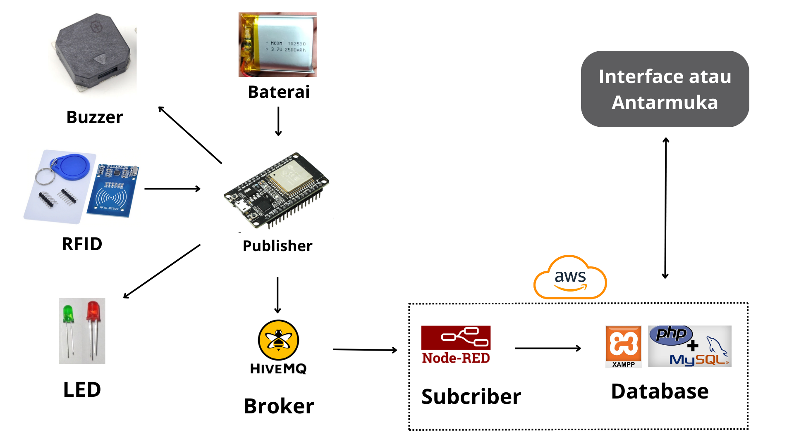

# TapSit

  

# Sistem Pemilihan dan Pemantauan Tempat Duduk Berbasis RFID untuk Optimalisasi Industri F&B

Proyek ini bertujuan untuk mengembangkan sistem monitoring otomatis yang memantau ketersediaan tempat duduk di kafe dan restoran, menggunakan mikrokontroler ESP32 dan teknologi RFID. Sistem ini memungkinkan pelanggan untuk memilih meja dengan mengetuk kartu RFID, yang secara instan memperbarui status meja. Data yang dikumpulkan oleh cloud server disimpan dalam database lokal dan ditampilkan di monitor kasir, memungkinkan staf untuk melihat meja yang kosong dan terisi. Dengan demikian, sistem ini meningkatkan kenyamanan pelanggan dan efisiensi operasional, serta mengurangi waktu tunggu dan kesalahan.

`WORKSHOP MIKROKONTROLLER - PROGRAM STUDI TEKNIK ELEKTRONIKA - POLITEKNIK ELEKTRONIKA NEGERI SURABAYA`

`DOSEN PENGAMPU : Akhmad Hendriawan ST, MT`
`NIP. 197501272002121003`

## Manfaat
* Mengoptimalkan Pengelolaan Tempat Duduk
* Mengurangi Waktu Tunggu Pelanggan
* Meningkatkan Efisiensi Operasional
* Meningkatkan Kepuasan Pelanggan
* Mengurangi Kesalahan dalam Pengelolaan Tempat Duduk
* Memudahkan Rotasi Pelanggan
* Peningkatan Citra Modern dan Teknologi

## Keunggulan
* Pemantauan Real-time
* Otomatisasi Berbasis IoT
* Modular dan Skalabel
* Kompatibilitas dengan Infrastruktur Jaringan Lokal
* Visualisasi yang Jelas untuk Staf
* Penggunaan Teknologi RFID yang Cepat dan Aman
* Fleksibilitas Protokol Komunikasi

## Development
### Tahun 1
* Monitoring kursi kosong dalam waktu nyata.
* Akses ke platform pemantauan tempat duduk berbasis cloud
* Notifikasi kursi kosong dalam waktu nyata.
* Laporan penggunaan kursi bulanan.
* Dukungan perangkat keras untuk 10 unit pembaca RFID.
### Tahun 2
* Pemantauan multi-lokasi (hingga 3 cabang).
* Laporan penggunaan kursi mingguan dan bulanan.
* Integrasi dengan aplikasi reservasi pihak ketiga.
* Dukungan perangkat keras untuk 30 unit pembaca RFID.
### Tahun 3
* Analitik lanjutan dan laporan custom sesuai permintaan.
* Dukungan pemantauan untuk hingga 10 lokasi.
* Sistem pemesanan kursi langsung untuk pelanggan melalui aplikasi mobile.
* Dukungan perangkat keras untuk 50 unit pembaca RFID.

## Teammates

  
  
| No.            | Nama                | NRP            | Pembagian Tugas  |
| :-------------:| :------------------:| :-------------:| :---------------:|
| 1              | Muhammad Faqidin    | 2122600013     | Project Manager, Publikasi melalui Github  |
| 2              | Ahmad Zen Ashari    | 2122600009     | Hardware, Desain Skematik dan Hardware, Publikasi melalui Github |
| 3              | Fadlan Surya        | 2122600024     | Sofware, Mengatur Koneksi Hardware ke Broker, Publikasi melalui Github |
| 4              | Adib Tantowi        | 2122600001     | UI/UX Designer, Membuat tampilan Web Server, Publikasi melalui Github |
| 5              | Rizka Sugiharto     | 2122600008     | Data Analyst, Mengambil data dari Broker ke DataBase, Publikasi melalui Github|
| 6              | M Lukman Al Khakim  | 2122600010     | Procurement Product, Proses Perakitan dan Soldering, Publikasi melalui Github   |

# Daftar Isi
- [Desain Produk](#Desain-Produk)
- [Diagram Arsitektur Sistem](#Diagram-Arsitektur-Sistem)
- [Hardware](#Hardware)
    * [Rangkaian Skematik](#Rangkaian-Skematik)
    * [Pin I/O](#Pinout)
    * [Layout PCB](#Layout-PCB)
- [Software](#Software)
    * [Aktifasi SSL/TLS di Broker HiveMQ CLoud](#aktifasi-ssltls-di-broker-hivemq-cloud)
- [Rincian Biaya](#Rincian-Biaya)

# Desain Produk

 ![Tampilan Produk 0][def0]
 ![Tampilan Produk 1][def1]
 ![Tampilan Produk 2][def2]

[def0]: /assets/Desain1.png
[def1]: /assets/Desain2.png
[def2]: /assets/Desain3.png
[Download File 3D](https://www.thingiverse.com/thing:6816870)

# Diagram Arsitektur Sistem

# Hardware
## Rangkaian Skematik

 ## Layout PCB
  

 Menggunakan PCB 2 Layer 

  ## Pinout yang Dipakai

Pin GPIO34 | untuk data input baterai 
Pin GPIO26 | untuk indikator LED 
Pin GPIO27 | untuk indikator LED 
Pin GPIO13 | untuk input interrupt 
Pin GPIO14 | untuk output buzzer 
Pin MISO   | untuk RFID  
Pin MOSI   | untuk RFID 
Pin SCK    | untuk RFID 
Pin SDA    | untuk RFID 
Pin RST    | untuk RFID 
Pin 3,3V   | untuk input tegangan 
Pin GND    | untuk ground 

# Software
Selamat datang di proyek ini. Berikut adalah beberapa panduan yang mungkin Anda butuhkan:
- [Aktifasi SSL/TLS di Broker HiveMQ CLoud](MQTT/MQTT.md)
- [Membuat Cloud di AWS Console (EC2)](Cloud/VPS.md)
- [Koneksi Broker dengan Database Menggunakan Node-Red](Database/progres.md)

# Rincian Biaya

| No  | Item                   | Jumlah | Harga   | Total   |Link|
|-----|------------------------|--------|---------|---------|-----|
| 1   | ESP32 Devkitc 32D      | 1      | 66.900  | 66.900  |[Buy](https://s.shopee.co.id/g7zNegvfe) |
| 2   | Buzzer SMD 8530 3V     | 1      | 4.000   | 4.000   |[Buy](https://www.tokopedia.com/marnov/buzzer-smd-8530-3v-16r-8-5-3mm-piezo-mini-aktif-pasif?extParamsrc%3Dshop%26whid%3D225282) |
| 3   | LED SMD 1206           | 2      | 140     | 280     |[Buy](https://tokopedia.link/4pipX6fPrNb)|
| 4   | RFID MRFC 522          | 1      | 14.000  | 14.000  |[Buy](https://s.shopee.co.id/sIaWPa9R)         |
| 5   | Resistor SMD 1206      | 3      | 150     | 450     |[Buy](https://tokopedia.link/CMivhgmPrNb)    |
| 6   | Etching Papan PCB      | 1      | 8.000   | 8.000   |   |
| 7   | 3D print casing        | 1      | 20.000  | 20.000  |     |
| 8   | TP4056 1A 5V Lithium   | 1      | 4.000   | 4.000   |[Buy](https://www.tokopedia.com/isee/tp4056-1a-5v-lithium-lipo-18650-battery-charging-usb-type-c-proteksi) |
| 9   | Lithium 2500mah 3.7V   | 1      | 37.000  | 37.000  |[Buy](https://id.shp.ee/LSUCxvz)                |
|     |                        |        | **TOTAL** | 154.630 |

# Cara Penggunaan 
1. Pastikan perangkat dalam kondisi menyala dan telah berhasil terhubung dengan jaringan Wi-Fi untuk memastikan kelancaran proses komunikasi data.
2. Pada tampilan web server, sistem akan menampilkan status setiap meja; meja yang belum terisi akan ditandai dengan warna hijau, sementara meja yang telah terisi akan ditandai dengan warna merah, memungkinkan pemantauan kondisi secara visual.
3. Tempelkan kartu RFID yang sudah terdaftar pada perangkat untuk mengaktifkan proses pengenalan identitas melalui sensor.
4. Data dari kartu RFID yang ditempelkan akan secara otomatis dikirim dan disimpan dalam database untuk tujuan pencatatan dan pemantauan.
5. Pada perangkat atau meja yang sama, sistem database hanya akan memperbarui informasi terkait kondisi terakhir RFID serta status pemantauan baterai untuk efisiensi penyimpanan dan pemrosesan data.
6. Setelah kartu RFID berhasil ditempelkan pada perangkat, tampilan pada web server akan secara otomatis diperbarui, menunjukkan bahwa meja tersebut telah terisi, berkat registrasi yang telah terjadi melalui perangkat.

Untuk memberikan gambaran yang lebih jelas, video ini akan menunjukkan seluruh proses, mulai dari pengaktifan hingga penggunaan alat dalam berbagai kondisi, sehingga Anda bisa memahami manfaat dan efisiensi alat kami yang dapat diakses pada link [berikut ini](https://youtu.be/MPJk97POcxs?si=4I_-UE-o9XQQt0bo)