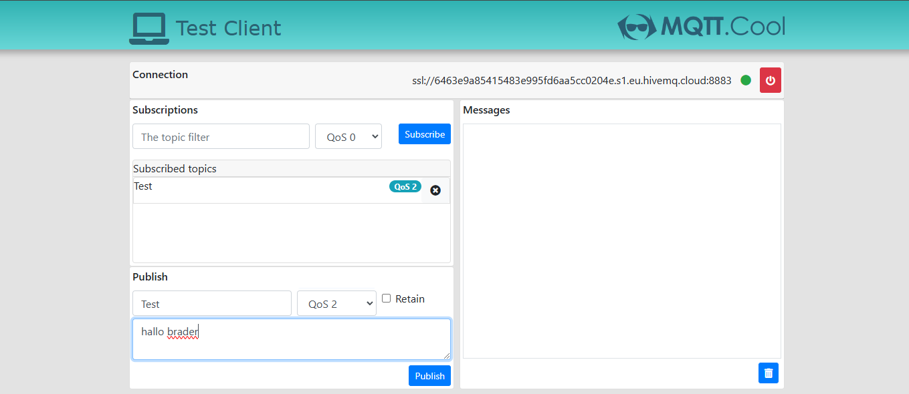

  <h3>WORKSHOP MIKROKONTROLLER - PROGRAM STUDI TEKNIK ELEKTRONIKA - POLITEKNIK ELEKTRONIKA NEGERI SURABAYA</h3>
  
DOSEN PENGAMPU : Akhmad Hendriawan ST, MT   NIP. 197501272002121003

# TapSit

  

# Sistem Pemilihan dan Pemantauan Tempat Duduk Berbasis RFID untuk Optimalisasi Industri F&B

Proyek ini bertujuan untuk mengembangkan sistem monitoring otomatis yang memantau ketersediaan tempat duduk di kafe dan restoran, menggunakan mikrokontroler ESP32 dan teknologi RFID. Sistem ini memungkinkan pelanggan untuk memilih meja dengan mengetuk kartu RFID, yang secara instan memperbarui status meja. Data yang dikumpulkan oleh cloud server disimpan dalam database lokal dan ditampilkan di monitor kasir, memungkinkan staf untuk melihat meja yang kosong dan terisi. Dengan demikian, sistem ini meningkatkan kenyamanan pelanggan dan efisiensi operasional, serta mengurangi waktu tunggu dan kesalahan.

# The Stackholder
| No | Name                   | Role                                                               |
|----|------------------------|--------------------------------------------------------------------|
| 1  | Muhammad Faqidin       | Project Manager                                                    |
| 2  | Ahmad Zen Azhari       | Hardware Development                                               |
| 3  | Fadlan Surya           | Software Development                                               |
| 4  | Adib Tantowi           | UI/UX Designer                                                     |
| 5  | Rizka Sugiharto        | Data Analyst                                                       |
| 6  | M Lukman Al Khakim     | Procurement Product                                                |

# Daftar Isi
- [Hardware](#Hardware)
    * [Rangkaian Skematik](#Rangkaian-Skematik)
    * [Pin I/O](#Pinout)
    * [Layout PCB](#Layout-PCB)
- [Software](#Software)
    * [Aktifasi SSL/TLS di Broker HiveMQ CLoud](#aktifasi-ssltls-di-broker-hivemq-cloud)
- [Hasil Produk](#Hasil-Produk)
- [Rincian Biaya](#Rincian-Biaya)

# Hardware
  ## A. Rangkaian Skematik

  ## B. Pinout

    <table>
        <thead>
            <tr>
                <th>No</th>
                <th>Pin GPIO Ke- </th>
                <th>Alasan</th>
                <th>Fungsi</th>
            </tr>
        </thead>
        <tbody>
            <tr>
                <td>1</td>
                <td>32</td>
                <td>Aman untuk I/O</td>
                <td>Input info daya baterai</td>
            </tr>
            <tr>
                <td>2</td>
                <td>15</td>
                <td>Aman untuk I/O</td>
                <td>Output ke buzzer</td>
            </tr>
            <tr>
                <td>3</td>
                <td>33</td>
                <td>Aman untuk I/O</td>
                <td>Output ke LED_G</td>
            </tr>
            <tr>
                <td>5</td>
                <td>17</td>
                <td>Aman untuk I/O</td>
                <td>Output ke LED_R</td>
            </tr>
             <tr>
                <td>6</td>
                <td>3,3V</td>
                <td>default</td>
                <td>Daya RFID</td>
            </tr>
             <tr>
                <td>7</td>
                <td>GND 3</td>
                <td>default</td>
                <td>GND RFID</td>
            </tr>
             <tr>
                <td>8</td>
                <td>5</td>
                <td>default</td>
                <td>Pin SDA RFID</td>
            </tr>
             <tr>
                <td>9</td>
                <td>18</td>
                <td>default</td>
                <td>Pin SCK RFID</td>
            </tr>
             <tr>
                <td>10</td>
                <td>23</td>
                <td>default</td>
                <td>Pin MOSI RFID</td>
            </tr>
             <tr>
                <td>11</td>
                <td>19</td>
                <td>default</td>
                <td>Pin MISO RFID</td>
            </tr>
             <tr>
                <td>12</td>
                <td>0</td>
                <td>default</td>
                <td>Pin RST RFID</td>
            </tr>
               <tr>
                <td>13</td>
                <td>Vin</td>
                <td>default</td>
                <td>Daya ESP32</td>
            </tr>
               <tr>
                <td>14</td>
                <td>GND1</td>
                <td>default</td>
                <td>G pembagi (V) dan G ESP32</td>
            </tr>
               <tr>
                <td>15</td>
                <td>GND2</td>
                <td>default</td>
                <td>G LED_R dan G LED_G</td>
            </tr>
         </tbody>
    </table>

File Download<a href="https://drive.google.com/file/d/1diomlFyTaUs_eFDkaGRLsYESl7vDo8c1/view?usp=sharing">Link</a>.

   

 

  ## C. Layout PCB
  

  

  
 Menggunakan PCB 2 Layer  Ukuran jalur 0,75mm dan 0,3mm

  
File Download  <a href="https://drive.google.com/file/d/1fTUtGnzqFyHy10sOkZaSZF4weKkYOswV/view?usp=sharing"> Link </a>

 

# Software

## Aktifasi SSL/TLS di Broker HiveMQ Cloud
Jika kamu menggunakan HiveMQ Cloud (layanan broker MQTT yang di-host oleh HiveMQ) dan ingin mengaktifkan SSL/TLS untuk koneksi aman, berikut langkah-langkahnya:
### 1. Buat Akun dan Masuk ke HiveMQ Cloud
   * Kunjungi situs HiveMQ Cloud.
   * Buat akun atau login jika sudah memiliki akun.
   * Setelah masuk, kamu akan diarahkan ke dashboard HiveMQ Cloud.
### 2.  Buat atau Kelola MQTT Cluster
   * Di dashboard, klik "Create Cluster" untuk membuat broker MQTT baru jika belum ada. Jika sudah ada cluster, pilih cluster yang ingin kamu konfigurasi.
   
   
   * Setelah memilih atau membuat cluster, kamu akan masuk ke halaman detail cluster.
   
   
### 3. Mengaktifkan SSL/TLS di HiveMQ Cloud
HiveMQ Cloud secara otomatis mengaktifkan SSL/TLS untuk koneksi aman. Kamu tidak perlu secara manual membuat atau mengunggah sertifikat, karena HiveMQ Cloud menggunakan sertifikat yang diterbitkan oleh Let's Encrypt atau penyedia sertifikat lainnya untuk mengamankan koneksi.
1. Port TLS: HiveMQ Cloud biasanya menyediakan dua port:
* Port MQTT tanpa TLS (1883).
* Port MQTT dengan TLS (8883).
Kamu hanya perlu memastikan bahwa klien MQTT yang kamu gunakan terhubung ke port 8883 untuk koneksi aman menggunakan SSL/TLS.

### 4. Navigasi ke Pengaturan Otentikasi
1. Pada halaman detail cluster, pilih menu "Access Management" atau "Authentication" di bagian navigasi atas.

2. Di halaman Authentication, kamu akan menemukan opsi untuk mengatur otentikasi username dan password.
   
### 5. Menambahkan Username dan Password
1. Di halaman Authentication, akan ada opsi untuk "Add User" atau "Create new credentials".

2. Klik "Add User".

  * Username: Masukkan username untuk klien yang akan menghubungkan ke broker MQTT.
  * Password: Masukkan password untuk username tersebut. Pastikan menggunakan password yang kuat untuk keamanan.
  Setelah mengisi username dan password, klik "Save" atau "Add" untuk menyimpan kredensial tersebut.

### 6. Uji Koneksi Dengan Dengan MQTT.Cool
1. Buka Situs Test Client
Kunjungi https://testclient-cloud.mqtt.cool/ menggunakan browser.

2. Masukkan Informasi Broker MQTT
Setelah halaman terbuka, isi informasi koneksi broker yang relevan di antarmuka web:

   * Broker Address: Masukkan hostname atau alamat IP dari broker HiveMQ Cloud kamu. Misalnya, `your_hivemq_cluster_host`.
   * Port: Gunakan 8883, yang merupakan port standar untuk koneksi MQTT over TLS/SSL.
   * Client ID: Buat Client ID unik. Misalnya, `TestClient-12345`.
   * Username dan Password: Jika HiveMQ mengharuskan autentikasi, masukkan username dan password yang telah dikonfigurasi.

Aktifkan opsi untuk SSL/TLS dengan mencentang atau memilih opsi yang sesuai (biasanya berupa checkbox atau pilihan yang diberi label Enable SSL atau Use TLS). Ini memastikan bahwa koneksi ke broker HiveMQ menggunakan enkripsi.

3. Connection Settings

Pada navigasi Web client isi username dan password sesuai dengan Credential yang sudah dibuat pada autentification. Buatlah topik yang misalnya`Test` kemudian subcribe dan ubah Qos menjadi 2. 

setelah itu klik tombol connect untuk mengaktifkan koneksi broker.

4. Connect to Broker

Klik Connect atau tombol sejenis untuk mencoba terhubung ke broker HiveMQ. Jika semua konfigurasi sudah benar, klien testclient-cloud.mqtt.cool akan berhasil terhubung ke broker melalui TLS/SSL, dan status akan menunjukkan bahwa kamu terhubung.

### 7. Uji Pengiriman dan Penerimaan Pesan
Setelah koneksi berhasil:
   * Gunakan bagian Publish untuk mengirim pesan ke topik tertentu. Masukkan nama topik dan payload pesan, lalu klik Publish.
   * Untuk menerima pesan, gunakan bagian Subscribe untuk berlangganan ke topik tertentu. Masukkan nama topik dan klik Subscribe. Kamu akan menerima pesan apa pun yang dipublikasikan ke topik tersebut oleh klien lain atau oleh klien ini sendiri.

### 8. Mengelola Username dan Password
* Kamu dapat kembali ke halaman Security/Authentication kapan saja untuk menambahkan, mengedit, atau menghapus username dan password.
* Ini berguna jika kamu ingin memberikan akses kepada lebih banyak klien atau ingin mengganti kredensial yang ada untuk meningkatkan keamanan.

Dengan pengaturan ini, broker HiveMQ Cloud kamu sudah aman dengan autentikasi berbasis username dan password, dan setiap klien yang mencoba mengakses harus memberikan kredensial yang valid.

# Hasil Produk
# Rincian Biaya

| No  | Item                   | Jumlah | Harga   | Total   |Link|
|-----|------------------------|--------|---------|---------|-----|
| 1   | ESP32 Devkitc 32D      | 1      | 66.900  | 66.900  |[Buy](https://s.shopee.co.id/g7zNegvfe) |
| 2   | Buzzer SMD 8530 3V     | 1      | 4.000   | 4.000   |[Buy](https://www.tokopedia.com/marnov/buzzer-smd-8530-3v-16r-8-5-3mm-piezo-mini-aktif-pasif?extParamsrc%3Dshop%26whid%3D225282) |
| 3   | LED SMD 1206           | 2      | 140     | 280     |[Buy](https://tokopedia.link/4pipX6fPrNb)|
| 4   | RFID MRFC 522          | 1      | 14.000  | 14.000  |[Buy](https://s.shopee.co.id/sIaWPa9R)         |
| 5   | Resistor SMD 1206      | 3      | 150     | 450     |[Buy](https://tokopedia.link/CMivhgmPrNb)    |
| 6   | Etching Papan PCB      | 1      | 8.000   | 8.000   |   |
| 7   | 3D print casing        | 1      | 20.000  | 20.000  |     |
| 8   | TP4056 1A 5V Lithium   | 1      | 4.000   | 4.000   |[Buy](https://www.tokopedia.com/isee/tp4056-1a-5v-lithium-lipo-18650-battery-charging-usb-type-c-proteksi) |
| 9   | Lithium 2500mah 3.7V   | 1      | 37.000  | 37.000  |[Buy](https://id.shp.ee/LSUCxvz)                |
|     |                        |        | **TOTAL** | 154.630 |

